# stm32F103rct6的交叉编译环境的搭建
stm32大致分为3种开发模式，分别是寄存器开发，标准固件库开发，HAL库开发    
先搭建标准固件库的开发环境用来上手，基础知识也在这个过程中记录，后续直接进行步骤的记录  
## 下载arm-none-ebai交叉编译工具链  
windows需要去arm官网下载，工具链包含gcc,gdb,ld,objdump等等常用编译工具  
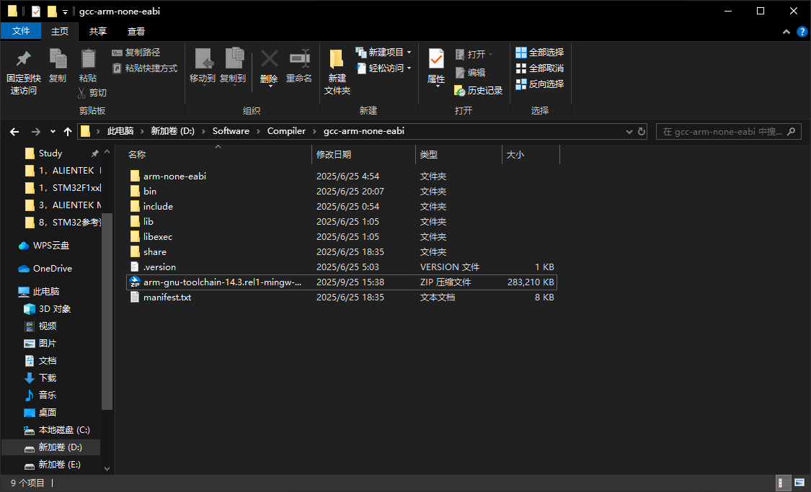
## 下载openocd开源烧录工具  
### Windows
官网下载win32-x64.zip的预编译压缩包，解压添加环境变量即可使用
### Linux  
Ubuntu 22.04自带openocd，果然开发还是使用Linux更爽一点  
## ST官网下载开源的固件库源码

## stm32标准固件库工程模板  
这里我想采用一些比较难个性，比较通用的写法，传统一些的版本可能会后面作为补充  
这个工程模板采纳了一些我看到的资料  
首先要有那么一个目录用来存放工程  
然后在这个工程中存放一些使stm32启动所必须的文件，没有这些文件，stm32就无法启动，这也是比较麻烦的一个点  
工程目录中有子目录如下：
1. Core：存放stm32的启动文件  
2. Library：存放固件库，底层外设的驱动  
3. User：main.c以及其他重要的用户文件  
4. System：供整个系统使用的公共模块  
5. Moudle：自己写的外设代码，shi山点灯代码  
6. build：编译的乱七八糟文件  
7. utils：好用的工具脚本，gpt大哥写的  
8. doc：常用的文档或注释，杂七杂八废料收集区  

### Core目录配置  
#### 一、startup_stm32f10x_xx.s
1. 配置启动文件，在我的stm32F103rct6型芯片上使用的是startup_stm32f10x_hd.s启动文件，STM32 的启动文件（startup_stm32f10x_xx.s）主要做以下工作：  
1.1 设置中断向量表（不同型号的中断数量不同）。  
1.2 初始化堆栈指针（Stack Pointer）。  
1.3 调用 Reset_Handler（最终会跳转到 main 函数）。  
1.4 定义默认中断处理函数（如 HardFault_Handler、NMI_Handler 等）。  
2. 由于不同型号的stm32配置不同：  
2.1 Flash/RAM的大小不同（影响堆栈配置）  
2.2 外设数量不同（影响中断向量表）  
2.3 启动方式不同（如Boot0/Boot1引脚配置）  
因此st官方为不同容量不同系列的stm32提供了不同的启动文件：  
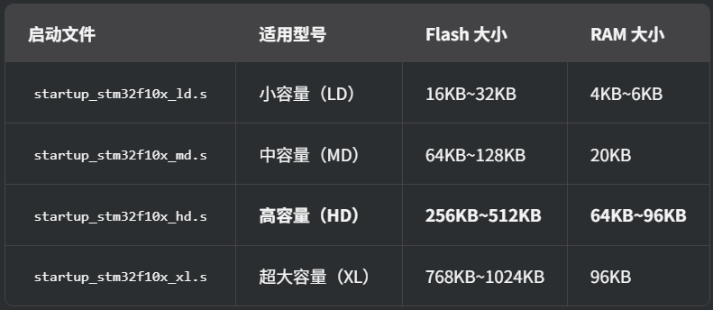  
3. 所以在我的stm32rct6上配置startup_stm32f10x_hd.s，将startup_stm32f10x_hd.s复制到Core目录下，startup_stm32f10x_hd.s的路径在：  
STM32F10x_StdPeriph_Lib_V3.6.0\Libraries\CMSIS\CM3\DeviceSupport\ST\STM32F10x\startup\gcc_ride7下  
这里需要注意的是，需要根据编译器的不同，选择不同的启动文件，一般keil中使用的是arm下的，而gcc使用的是gcc_ride7下的   
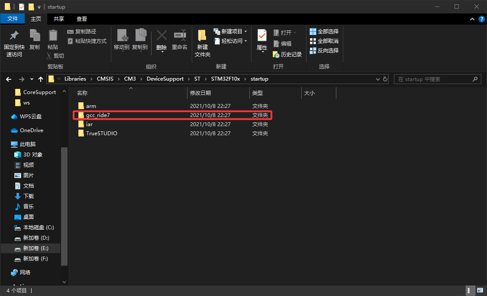  
#### 二、core_xxx文件  
1. 对于不同的ARM内核，都有不同的core_xxx.c/h文件，这是因为：  
1.1 硬件特性的差异  
不同 Cortex-M 内核的寄存器、指令集和外设支持不同，例如：  
Cortex-M3：支持 NVIC（嵌套向量中断控制器）、SysTick、MPU（内存保护单元）。  
Cortex-M4：在 M3 基础上增加了 FPU（浮点运算单元） 和 DSP（数字信号处理） 指令。  
Cortex-M0/M0+：精简版内核，不支持 MPU 和部分高级中断功能。  
Cortex-M7：性能更强，支持更复杂的缓存和双精度 FPU。  
1.2 CMSIS驱动层标准的分层设计  
ARM 的 CMSIS（Cortex Microcontroller Software Interface Standard）为不同内核提供了不同的 core_xxx 文件：  
core_cm0.h/c → Cortex-M0/M0+  
core_cm3.h/c → Cortex-M3  
core_cm4.h/c → Cortex-M4  
core_cm7.h/c → Cortex-M7  
这些文件定义了各自内核特有的寄存器、内联函数和宏。  
1.3 我使用的是stm32F103rct6，其搭载ARM Cortex-M3内核，应该使用core_cm3.c/h，下面展示一下core_cm3.h和core_cm4.h的具体差异  
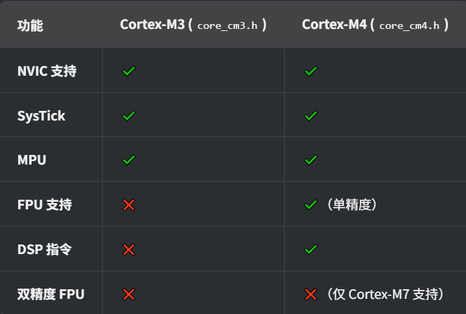
2. 所以根据1的内容，确实有必要引入这两个文件，core_cm3.c/h中定义了许多必不可少的东西，并且他们维护了CMSIS标准，这对移植非常重要  
2.1 core_cm3.h  
**寄存器定义**：如系统控制块（SCB）、NVIC（嵌套向量中断控制器）、SysTick（系统滴答定时器）等寄存器的地址和位定义。  
**内联函数**：用于访问 Cortex-M3 特有功能（如 __enable_irq()、__disable_irq()）。  
宏定义：如 NVIC_SetPriority()、SysTick_Config() 等。  
**数据类型定义**：如 __IO（volatile）、__I（只读）、__O（只写）等。  
2.2 core_cm3.c  
**部分函数实现**：如 SysTick_Config() 的具体逻辑。  
**中断向量表初始化**（某些版本可能包含）。  
**调试支持代码**（如 ITM（Instrumentation Trace Macrocell）相关函数）。  
3. 需要在路径  
STM32F10x_StdPeriph_Lib_V3.6.0\Libraries\CMSIS\CM3\CoreSupport  
一并移植到Core目录下  
#### 三、stm32f10x系列的核心文件  
1. stm32f10x.h（寄存器定义和外设访问层）  
**寄存器映射定义**：定义了 STM32F10x 系列所有外设（如 GPIO、USART、SPI、I2C、ADC 等）的寄存器地址和位操作宏。  
**外设结构体定义**：为每个外设提供结构体，方便通过指针方式访问寄存器（如 GPIOA->ODR）。  
**中断号和向量表定义**：定义了所有中断的编号（如 EXTI0_IRQn）和中断向量表。  
**时钟配置宏**：提供 HSE（外部高速时钟）、HSI（内部高速时钟）等配置宏。  
2. system_stm32f10x.h（系统配置声明）  
声明系统初始化函数：如 SystemInit()，用于配置系统时钟（如 PLL、HSE、HSI）。  
声明系统频率变量：如 SystemCoreClock，存储当前系统时钟频率（单位：Hz）。  
声明时钟更新函数：如 SystemCoreClockUpdate()，在时钟配置变化后更新 SystemCoreClock。  
3. system_stm32f10x.c（系统配置实现）  
实现 SystemInit()：配置系统时钟（如选择 HSE/HSI、设置 PLL 倍频、配置 AHB/APB 总线分频）。  
实现 SystemCoreClockUpdate()：根据当前时钟配置计算并更新 SystemCoreClock。  
默认时钟配置：如果用户未自定义时钟，会使用默认配置（如 72MHz 主频）。  
4. 这三者共同构成了 STM32F10x 的基础运行环境，缺一不可。如果你需要修改时钟配置，主要关注 system_stm32f10x.c；如果需要操作外设，则依赖 stm32f10x.h。  
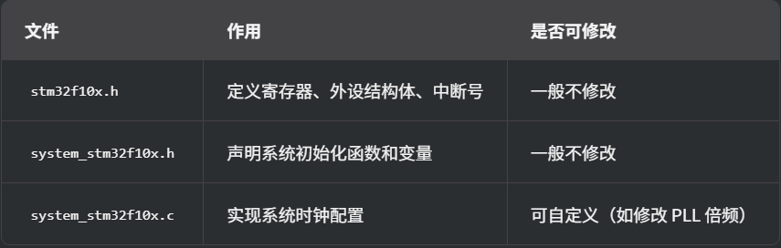  
5. 从路径  
STM32F10x_StdPeriph_Lib_V3.6.0\Libraries\CMSIS\CM3\DeviceSupport\ST\STM32F10x  
复制到Core下   
----  
到这里Core目录配置完毕  
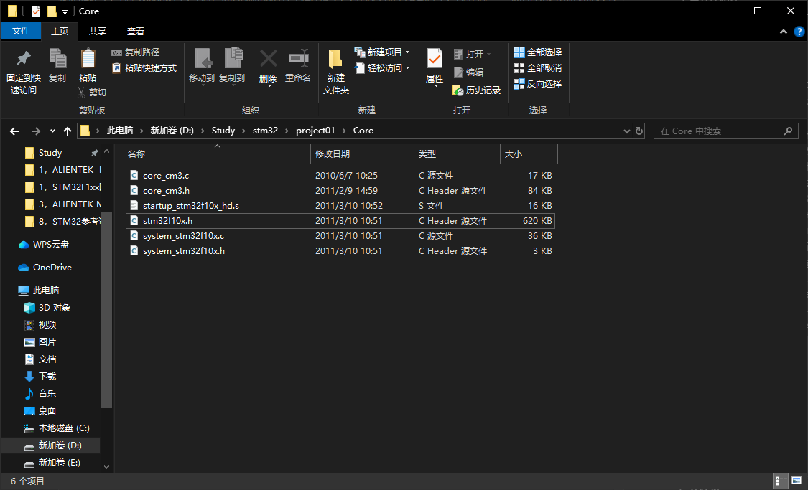  
### Library目录配置  
官方对stm32的外设做了一些封装，也就是通常所说的固件库，把这些封装好的固件库移植好就可以用了。  
从路径  
STM32F1xx固件库\STM32F10x_StdPeriph_Lib_V3.6.0\Libraries\STM32F10x_StdPeriph_Driver  
将头文件inc和源文件src全部复制到Library下，这样可以将头文件和源文件分开，更有层次。  
Library的配置还是比较轻松的，外设封装就相当于一些基础函数的封装，不涉及太底层的东西。  
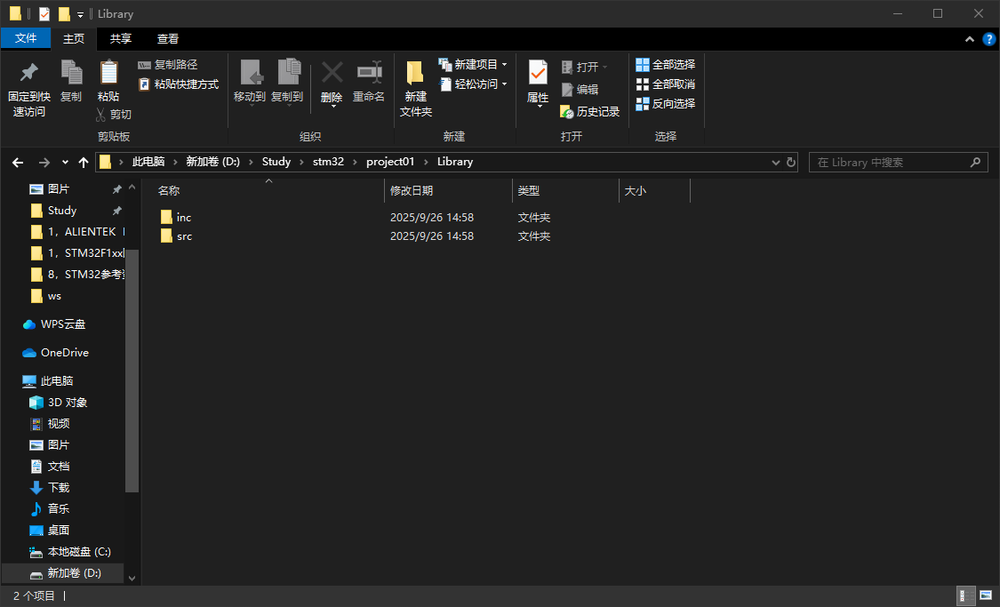  
---  
### User目录配置  
存放四个文件：  
1. main.c：程序入口起点  
2. stm32f10x_conf.h：主要用于控制外设库的启用和功能裁剪
3. stm32f10x_it.h/c：中断函数的声明and实现，STM32 的中断向量表（位于启动文件 startup_stm32f10x_xx.s）中定义了所有中断的入口地址。默认情况下，这些入口指向 stm32f10x_it.c 中的弱定义函数  
4. 也许可能还会需要main.h  
从路径：  
STM32F10x_StdPeriph_Lib_V3.6.0\Project\STM32F10x_StdPeriph_Template  
复制到User目录下  
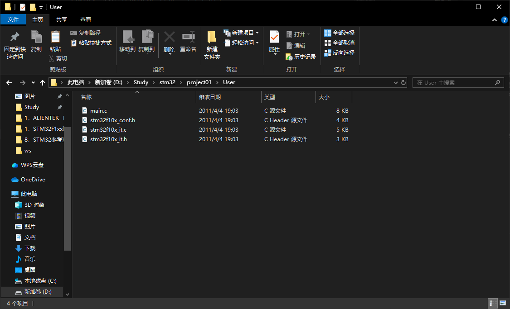  
---  

### System目录配置  
System下存储系统内部的资源  
例如延时函数等，暂时使用正点原子的试一下   
好吧，正点原子的uart文件中出现了gcc无法识别的预编译语句，应该是因为正点原子使用keil做项目，但是keil使用的是arm编译器，导致编译器的语法不兼容，删掉就好，留的底层在，不怕没板子烧。
---  
### Modules目录配置  
个人习惯分为inc、src，主要存放我们自己写的外设模块代码  
### build目录配置  
存放编译产生的文件  
### utils  
存放一些工具
目录下的gbk2utf8用于将GBK格式的文件转换为UTF-8格式，很有用  
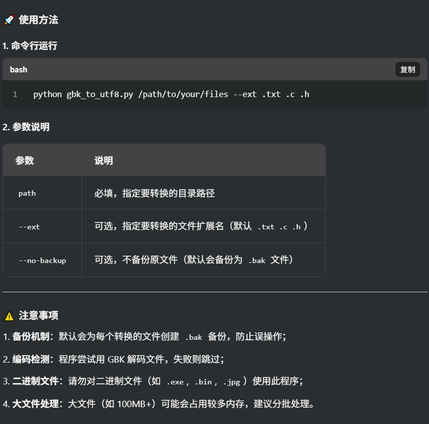
### doc  
存放一些记录
## makefile编写  
交叉编译需要使用交叉编译工具链，因为我使用stm32进行裸机编程，所以使用arm-none-eabi编译工具链，参考大量模板进而写出工程的makefile，希望尽快能够搭建出好用的开发环境  
### 一、项目工程的系统架构  
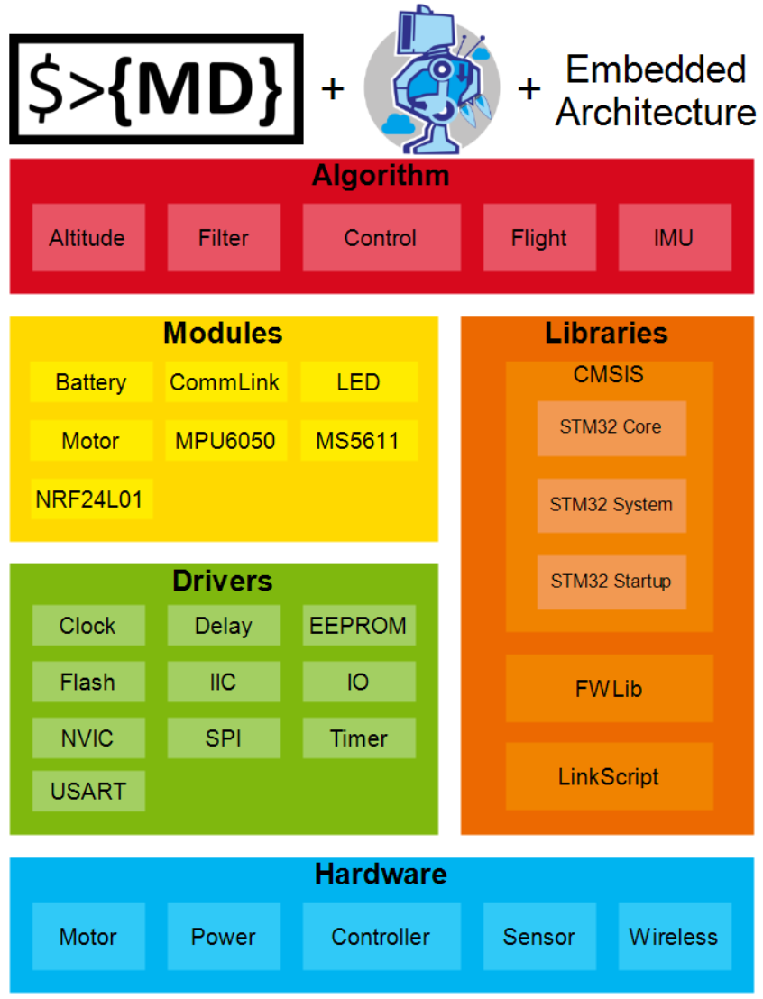  
层级大概就是这样，从寄存器变成堆堆堆，堆成一个可编程的微型计算机  
**CMSIS**：  
CMSIS是Cortex Microcontroller Software Interface Standard的简写，即ARM Cortex™微控制器软件接口标准。CMSIS是独立于供应商的Cortex-M处理器系列硬件抽象层，为芯片厂商和中间件供应商提供了简单的处理器软件接口，简化了软件复用工作，降低了Cortex-M上操作系统的移植难度，并减少了新入门的微控制器开发者的学习曲线和新产品的上市时间。以下是CMSIS 5.x标准的软件架构图：  
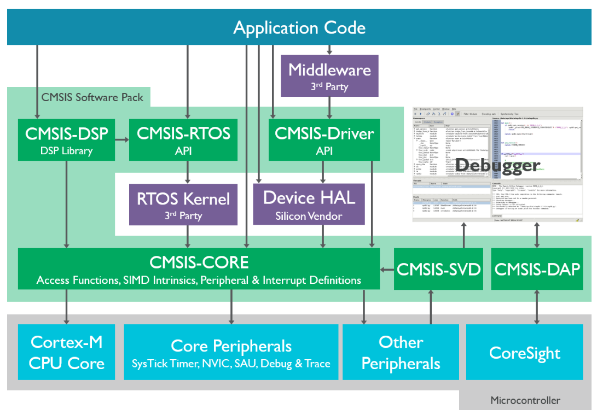  
从上图可以看到，CMSIS 5.x软件架构主要分为以下三层：应用代码层、CMSIS软件层 和 微控制器层，其中CMSIS软件层起着承上启下的作用，一方面该层对微控制器层进行了统一的实现，屏蔽了不同厂商对Cortex-M系列微处理器核内外设寄存器的不同定义，另一方面又向上层的操作系统和应用层提供接口，简化了应用程序开发的难度，使开发人员能够在完全透明的情况下进行一些应用程序的开发。  
简而言之，CMSIS做了类似于统一上层接口的工作，使得移植工作的难度得到了改善，虽然这个上层接口比我们的想象要更加底层。  
**FWLIB**：
这个库对应与项目中的Library，是STM32官方提供的固件库源码，它基于STM32F1系列芯片的内部寄存器架构并根据CMSIS命名规范封装了一套完整的底层操作函数，方便用户进行应用开发。FWLib下的inc目录下存放的是stm32f10x_xxx.h形式的头文件，src目录下存放的是stm32f10x_xxx.c形式的固件库源码文件，每一个.c文件和一个.h文件相对应，用于实现命名中由xxx所指定的功能。  
其实可以理解为就是驱动库，比如中断、运算、线程等比较底层的CPU核心的驱动  
总而言之：  
CMSIS完成了最底层的寄存器定义；  
ST官方根据在CMSIS的基础上写了外设的驱动库，比如GPIO啥的；再上层就是我们自己写的了，比如点一个灯，点俩灯，点一排灯，跑马灯，呼吸灯；  
再再再上层就是可以引入一些甚至与硬件不相关的算法层，比如pid（用过电机都懂），一些自定义的通讯协议（比如上下位机，当然难得我也不会）。  
### 二、Makefile的编写  
确实不想下载stm32cubeMX，其实stm32cubeMX能够生成很好用的Makefile，但是它总是硬推HAL库，我可不想像萌新一样在它给我构建好的工程里躺平，这大概就是底层的烦恼吧。另外我也确实不想安装stm32cubeMX，又要邮箱验证又要安装乱七八糟一堆东西，真不知道这goushi公司怎么牛逼起来的（纯他妈keil带飞）。  
参考了几篇博客的Makefile，但是都一般般的感觉，还是需要改一改，毕竟底层这东西能拿过来直接用的也不太多。另外我很讨厌特别高级的语法和函数（非必要情况下的炫技装逼行为），所有的实现都是追求简单高效。  
首先给这个工程取个名字，就叫他template吧  
#### Linux
```make
TARGET := template

# cross compiler platform
# Linux

# debug build?
DEBUG = 0;

# rtos?
RTOS = 0;

# optimization
OPT += -Og
OPT += -fsingle-precision-constant
OPT += -fno-common
OPT += -ffunction-sections
OPT += -fdata-sections
# OPT = -O0
# OPT = -O1/2/3
# OPT = -Os


# Path
#######################################################
INC_LIBRARY += ../Library/inc/
SRC_LIBRARY += ../Library/src

INC_MODULES += ../Modules/inc/
SRC_MODULES += ../Modules/src

INC_SYSTEM += ../System/inc/
SRC_SYSTEM += ../System/src

BUILD_DIR = ./others
TARGET_DIR = ./object

#######################################################

# cross compiler
#######################################################
PREFIX = arm-none-eabi-
CC  = $(PREFIX)gcc
CXX = $(PREFIX)g++
CP  = $(PREFIX)objcopy
GDB = $(PREFIX)gdb
SZ  = $(PREFIX)size
AS  = $(PREFIX)gcc -x assembler-with-cpp
HEX = $(CP) -O ihex
BIN = $(CP) -O binary -S
#######################################################


# C_FLAGS
#######################################################

# cpu
CPU = -mcpu=cortex-m3			# 核心的型号
FLASH_START = 0x08000000		# Flash起始地址，stm32F10x系列的标准地址

# fpu
# cortex-m3没有硬件浮点单元
FPU = 

# float-abi
# cortex-m3没有硬件浮点单元
FLOAT-ABI = -mfloat-abi=soft

# mcu
MCU = $(CPU) -mthumb $(FPU) $(FLOAT-ABI)

# include
C_INCLUDES = \
			-I../Core/ \
		   	-I../User/ \
		   	$(addprefix -I, $(INC_LIBRARY))	\
		   	$(addprefix -I, $(INC_MODULES))	\
		   	$(addprefix -I, $(INC_SYSTEM))	\

# source
C_SOURCES = \
			$(wildcard ../Core/*.c)			\
			$(wildcard ../User/*.c)			\
			$(wildcard $(SRC_LIBRARY)/*.c)	\
			$(wildcard $(SRC_MODULES)/*.c)	\
			$(wildcard $(SRC_SYSTEM)/*.c)	\

# asm insludes
AS_INCLUDES = 


# asm source
ASM_SOURCES = \
			$(wildcard ../Core/*.s)			\

# c defines
C_DEFS = \
		 -D STM32F10X_HD \
		 -D USE_STDPERIPH_DRIVER \

# asm defines
AS_DEFS = 

# compile gcc flags
AS_FLAGS += $(MCU) $(AS_DEFS) $(AS_INCLUDES) $(OPT) -c -Wall
C_FLAGS  += $(MCU) $(C_DEFS) $(C_INCLUDES) $(OPT) -c -Wall

ifeq ($(DEBUG), 1)
C_FLAGS += -g -gdwarf-2
endif

# generate dependency information
C_FLAGS += -MMD -MP -MF"$(@:%.o=%.d)"

#######################################################

# LDFLAGS
#######################################################

# link script
LDSCRIPT = ./STM32F103RCTx_FLASH.ld

# libraries
ifeq ($(RTOS), 0)
LIBS = -lc -lm -lnosys
LIBDIR = 
LDFLAGS = $(MCU) -specs=nosys.specs -T$(LDSCRIPT) $(LIBDIR) $(LIBS) -Wl,-Map=$(BUILD_DIR)/$(TARGET).map,--cref -Wl,--gc-sections,--print-memory-usage
else
LIBS = -lc -lm
LIBDIR = 
LDFLAGS = $(MCU) -T$(LDSCRIPT) $(LIBDIR) $(LIBS) -Wl,-Map=$(BUILD_DIR)/$(TARGET).map,--cref -Wl,--gc-sections,--print-memory-usage
# LDFLAGS += -specs=nano.specs -u _printf_float
endif

all: $(TARGET_DIR) $(TARGET_DIR)/$(TARGET).elf $(TARGET_DIR)/$(TARGET).hex $(TARGET_DIR)/$(TARGET).bin

#######################################################

# build application
#######################################################

# make build dir
$(BUILD_DIR):
	mkdir -p $(BUILD_DIR)
$(TARGET_DIR):
	mkdir -p $(TARGET_DIR)

# list of c program objects
OBJECTS = $(addprefix $(BUILD_DIR)/,$(notdir $(C_SOURCES:.c=.o)))
vpath %.c $(sort $(dir $(C_SOURCES)))
# list of ASM program objects
OBJECTS += $(addprefix $(BUILD_DIR)/,$(notdir $(ASM_SOURCES:.s=.o)))
vpath %.s $(sort $(dir $(ASM_SOURCES)))

$(BUILD_DIR)/%.o: %.c Makefile | $(BUILD_DIR) 
	$(CC) $(C_FLAGS) -Wa,-a,-ad,-alms=$(BUILD_DIR)/$(notdir $(<:.c=.lst)) $< -o $@

$(BUILD_DIR)/%.o: %.s Makefile | $(BUILD_DIR)
	$(AS) $(C_FLAGS) $< -o $@

$(TARGET_DIR)/$(TARGET).elf: $(OBJECTS) Makefile
	$(CC) $(OBJECTS) $(LDFLAGS) -o $@
	$(SZ) $@

$(TARGET_DIR)/%.hex: $(TARGET_DIR)/%.elf | $(TARGET_DIR)
	$(HEX) $< $@
	
$(TARGET_DIR)/%.bin: $(TARGET_DIR)/%.elf | $(TARGET_DIR)
	$(BIN) $< $@	
	
#######################################################

# clean up
#######################################################
clean:
	-rm -fR $(BUILD_DIR)
	-rm -fR $(TARGET_DIR)
#######################################################

# write
#######################################################

write: $(TARGET_DIR)/$(TARGET).bin
	openocd -f ./stlink-v2.cfg	\
			-f ./stm32f1x.cfg	\
			-c "init; reset halt; wait_halt; flash write_image erase $(TARGET_DIR)/$(TARGET).bin $(FLASH_START); reset; shutdown;"
			@echo "Write Completed."
#######################################################

# erase
#######################################################

erase:
	openocd -f ./stlink-v2.cfg	\
			-f ./stm32f1x.cfg	\
			-c "init; reset halt; flash erase_sector 0 0 1; exit;"
			@echo "Erase Completed."

#######################################################

# reset
#######################################################

reset:
	openocd -f ./stlink-v2.cfg	\
			-f ./stm32f1x.cfg	\
			-c "init; reset; exit;"
			@echo "Reset Completed."

#######################################################

# depandencies
#######################################################

-include $(wildcard $(BUILD_DIR)/*.d)

#######################################################


```  
#### Windows 
```make
TARGET := template

# cross compiler platform
# Linux

# debug build?
DEBUG = 0;

# rtos?
RTOS = 0;

# optimization
OPT += -Og
OPT += -fsingle-precision-constant
OPT += -fno-common
OPT += -ffunction-sections
OPT += -fdata-sections
# OPT = -O0
# OPT = -O1/2/3
# OPT = -Os


# Path
#######################################################
INC_LIBRARY += ..\Library\inc\ 
SRC_LIBRARY += ..\Library\src

INC_MODULES += ..\Modules\inc\ 
SRC_MODULES += ..\Modules\src

INC_SYSTEM += ..\System\inc\ 
SRC_SYSTEM += ..\System\src

BUILD_DIR = others
TARGET_DIR = object

#######################################################

# cross compiler
#######################################################
PREFIX = arm-none-eabi-
CC  = $(PREFIX)gcc
CXX = $(PREFIX)g++
CP  = $(PREFIX)objcopy
GDB = $(PREFIX)gdb
SZ  = $(PREFIX)size
AS  = $(PREFIX)gcc -x assembler-with-cpp
HEX = $(CP) -O ihex
BIN = $(CP) -O binary -S
#######################################################


# C_FLAGS
#######################################################

# cpu
CPU = -mcpu=cortex-m3			# 核心的型号
FLASH_START = 0x08000000		# Flash起始地址，stm32F10x系列的标准地址

# fpu
# cortex-m3没有硬件浮点单元
FPU = 

# float-abi
# cortex-m3没有硬件浮点单元
FLOAT-ABI = -mfloat-abi=soft

# mcu
MCU = $(CPU) -mthumb $(FPU) $(FLOAT-ABI)

# include
C_INCLUDES = \
			-I..\Core\ \
		   	-I..\User\ \
		   	$(addprefix -I, $(INC_LIBRARY))	\
		   	$(addprefix -I, $(INC_MODULES))	\
		   	$(addprefix -I, $(INC_SYSTEM))	\

# source
C_SOURCES = \
			$(wildcard ../Core/*.c)			\
			$(wildcard ../User/*.c)			\
			$(wildcard $(SRC_LIBRARY)/*.c)	\
			$(wildcard $(SRC_MODULES)/*.c)	\
			$(wildcard $(SRC_SYSTEM)/*.c)	

# asm insludes
AS_INCLUDES = 


# asm source
ASM_SOURCES = \
			$(wildcard ../Core/*.s)			\

# c defines
C_DEFS = \
		 -D STM32F10X_HD \
		 -D USE_STDPERIPH_DRIVER \

# asm defines
AS_DEFS = 

# compile gcc flags
AS_FLAGS += $(MCU) $(AS_DEFS) $(AS_INCLUDES) $(OPT) -c -Wall
C_FLAGS  += $(MCU) $(C_DEFS) $(C_INCLUDES) $(OPT) -c -Wall

ifeq ($(DEBUG), 1)
C_FLAGS += -g -gdwarf-2
endif

# generate dependency information
C_FLAGS += -MMD -MP -MF"$(@:%.o=%.d)"

#######################################################

# LDFLAGS
#######################################################

# link script
LDSCRIPT = .\STM32F103RCTx_FLASH.ld

# libraries
ifeq ($(RTOS), 0)
LIBS = -lc -lm -lnosys
LIBDIR = 
LDFLAGS = $(MCU) -specs=nosys.specs -T$(LDSCRIPT) $(LIBDIR) $(LIBS) -Wl,-Map=$(BUILD_DIR)\$(TARGET).map,--cref -Wl,--gc-sections,--print-memory-usage
else
LIBS = -lc -lm
LIBDIR = 
LDFLAGS = $(MCU) -T$(LDSCRIPT) $(LIBDIR) $(LIBS) -Wl,-Map=$(BUILD_DIR)\$(TARGET).map,--cref -Wl,--gc-sections,--print-memory-usage
# LDFLAGS += -specs=nano.specs -u _printf_float
endif

all: $(TARGET_DIR) $(BUILD_DIR) $(TARGET_DIR)\$(TARGET).elf $(TARGET_DIR)\$(TARGET).hex $(TARGET_DIR)\$(TARGET).bin

#######################################################

# build application
#######################################################

# make build dir
$(BUILD_DIR):
	mkdir $(BUILD_DIR)
$(TARGET_DIR):
	mkdir $(TARGET_DIR)

# list of c program objects
OBJECTS = $(addprefix $(BUILD_DIR)/,$(notdir $(C_SOURCES:.c=.o)))
vpath %.c $(sort $(dir $(C_SOURCES)))
# list of ASM program objects
OBJECTS += $(addprefix $(BUILD_DIR)/,$(notdir $(ASM_SOURCES:.s=.o)))
vpath %.s $(sort $(dir $(ASM_SOURCES)))

$(BUILD_DIR)/%.o: %.c Makefile | $(BUILD_DIR) 
	$(CC) $(C_FLAGS) -Wa,-a,-ad,-alms=$(BUILD_DIR)\$(notdir $(<:.c=.lst)) $< -o $@

$(BUILD_DIR)/%.o: %.s Makefile | $(BUILD_DIR)
	$(AS) $(C_FLAGS) $< -o $@

$(TARGET_DIR)\$(TARGET).elf: $(OBJECTS) Makefile
	$(CC) $(OBJECTS) $(LDFLAGS) -o $@
	$(SZ) $@

$(TARGET_DIR)\\%.hex: $(TARGET_DIR)\\%.elf | $(TARGET_DIR)
	$(HEX) $< $@
	
$(TARGET_DIR)\\%.bin: $(TARGET_DIR)\\%.elf | $(TARGET_DIR)
	$(BIN) $< $@	
	
#######################################################

# clean up
#######################################################
clean:
	rmdir /s /q $(BUILD_DIR)
	rmdir /s /q $(TARGET_DIR)
#######################################################

# write
#######################################################

write: $(TARGET_DIR)/$(TARGET).bin
	openocd -f .\stlink-v2.cfg	\
			-f .\stm32f1x.cfg	\
			-c "init; reset halt; wait_halt; flash write_image erase $(TARGET_DIR)/$(TARGET).bin $(FLASH_START); reset; shutdown;"
			@echo "Write Completed."
#######################################################

# erase
#######################################################

erase:
	openocd -f .\stlink-v2.cfg	\
			-f .\stm32f1x.cfg	\
			-c "init; reset halt; flash erase_sector 0 0 1; exit;"
			@echo "Erase Completed."

#######################################################

# reset
#######################################################

reset:
	openocd -f .\stlink-v2.cfg	\
			-f .\stm32f1x.cfg	\
			-c "init; reset; exit;"
			@echo "Reset Completed."

#######################################################

# depandencies
#######################################################

-include $(wildcard $(BUILD_DIR)/*.d)

#######################################################

```

## Makefile编译过程中出现的问题
### 1.固件库源码中寄存器的使用问题    
操作系统：Ubuntu  
工具链：arm-none-eabi-gcc  
固件库：STM32F10x_StdPeriph_Lib_V3.6.0  
出现报错：在core_cm3.c中
```
Error: registers may not be the same -- `strexb r0,r0,[r1]'
Error: registers may not be the same -- `strexh r0,r0,[r1]'
make: *** [FLASH_RUN/core_cm3.o] Error 1
```  
这个问题与优化级别有关，不同的优化级别会出现不同的寄存器使用问题，但本质上都是由于寄存器重复使用出现的问题  
错误信息表明在编译ARM Cortex-M3的CMSIS核心文件时，汇编指令中使用了相同的寄存器作为源和目标：  
strexb r0,r0,[r1] - 试图将r0的值存储到r1指向的地址，并将结果状态存回r0  
strexh r0,r0,[r1] - 类似问题，但是半字存储操作  
在ARM架构中，STREXB和STREXH指令要求源寄存器和状态寄存器不能是同一个，这是硬件限制。  
解决方法：  
修改core_cm3.c中的736行、753行  
```c
uint32_t __STREXB(uint8_t value, uint8_t *addr)
{
   uint32_t result=0;
   // 修改前
   //__ASM volatile ("strexb %0, %2, [%1]" : "=r" (result) : "r" (addr), "r" (value) );
   // 修改后
   __ASM volatile ("strexb %0, %2, [%1]" : "=&r" (result) : "r" (addr), "r" (value) );
   return(result);
}

uint32_t __STREXH(uint16_t value, uint16_t *addr)
{
   uint32_t result=0;
   // 修改前
   //__ASM volatile ("strexh %0, %2, [%1]" : "=r" (result) : "r" (addr), "r" (value) );
   // 修改后
   __ASM volatile ("strexh %0, %2, [%1]" : "=&r" (result) : "r" (addr), "r" (value) );
   return(result);
}
```  
这段代码实现了ARM Cortex-M处理器中的独占存储（Exclusive Store）操作，这是实现原子操作的关键指令。  
这两个函数（STREXB和STREXH）分别实现了8位和16位的独占存储操作，用于多线程环境下的原子访问共享资源。  
实现的是8位数据和16位数据的存储操作，但是由于源寄存器和返回值寄存器使用同一个，并不能进行原子操作，所以将'=r'改为'=&r'，这样使得编译器可以自动分配寄存器的使用，不会出现resault和addr或value使用相同的寄存器。  
问题解决，编译通过。  
### 2.启动文件startup_stm32f10x_hd.s的版本问题  
问题：启动文件按照编译器的不同分为不同版本  
与keil MDK以及其他商用软件中的ARM编译器不同，我使用的使开源工具链arm-none-eabi-gcc  
ARM编译器与gcc所能够识别的语法是不同的，startup_stm32f10x_hd.s启动文件的语法也是不同的，所以不能够通用所有的.s文件  
解决方法：在st官方的固件库中，提供了不同版本的.s启动文件，当然，理论上来说改变语法也是可行的，因为它只是语法错误。将启动文件改为gcc_ride7目录下的适配文件  
  

